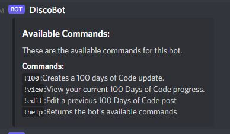

# 100-Days-Bot


## Description
This is a bot meant to be used with the application Discord. It keeps track of the user's progress towards a 100 Days of Coding challenge.

## Table of Contents
- [Installation](#installation)        
- [Usage](#usage)           

- [Contributing](#contributing)
- [Tests](#tests)
- [Questions?](#questions)
           
## Installation
Enter the following command into the command line to install dependencies: ```npm i```

## Usage
This bot will require the user to have admin access on a Discord server in order to be added to the server. The user also requires their own bot token which is acquired from the Discord Developer Portal. A MongoDB Atlas connection is also necessary.

Once added to a server the bot can be started by running the following commands in the command line: ```npm run build``` , ```npm run start```.

Typing !help in the Discord server will show a list of commands available to the bot.




## Contributing
Contact me using my information below, or submit a pull request.

## Tests
Enter the following command into the command line to test: ```There are no tests implemented for this project.```
           
## Questions?

View more of my work at the Github link below or contact me at the email below.

Github: [alexander-camacho](https://github.com/alexander-camacho)

Email: alsbrain@optonline.net